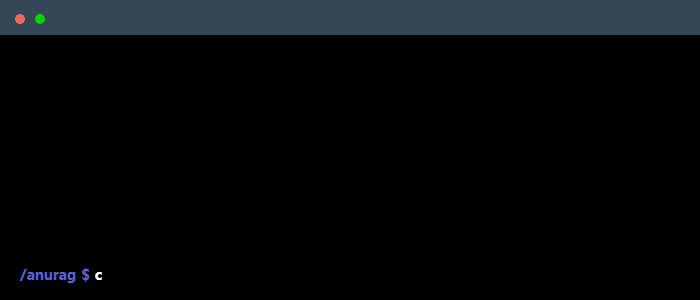

  

---

###  Main Skills

---

###  Studying

---

### Featured Projects 

- [**LeetScape**](https://leetscape.vercel.app) – Coding interview prep tracker
- [**Starune**](https://starune.vercel.app) – Stargazing weather app 
- [**AnimeVerse**](https://anime-verse-xi.vercel.app) – Anime tracking platform 
- [**Eclipz**](https://eclipz.vercel.app) – Anonymous chat space 

